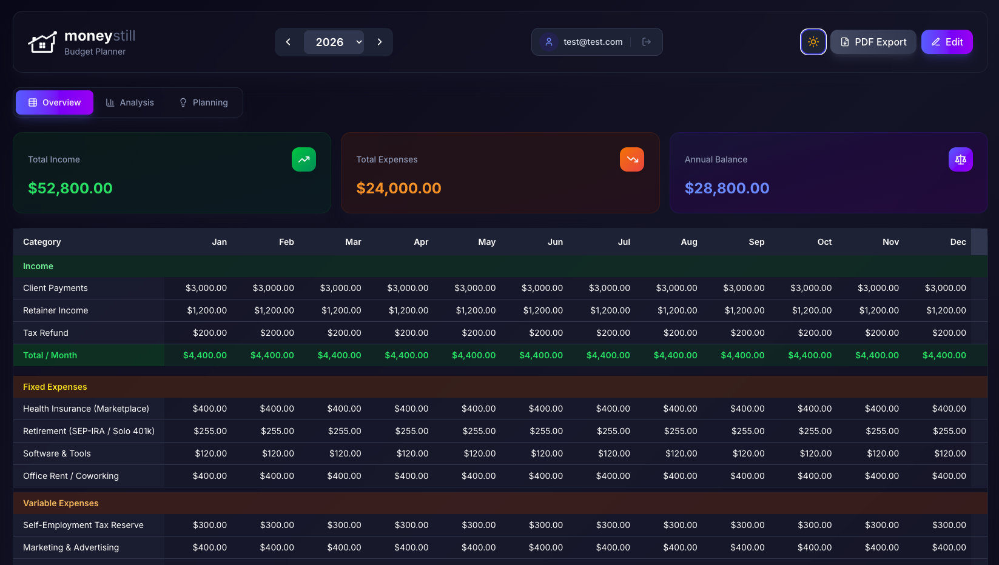

# 💰 moneystill – Budget Planner

[](https://www.gnu.org/licenses/agpl-3.0)
[](https://reactjs.org/)
[](https://pocketbase.io/)
[](http://makeapullrequest.com)

A premium, modern personal budget planning application built with **React** and **PocketBase**. Track income, expenses, and savings with elegant monthly breakdowns, scenario planning, rich analytics, and professional PDF exports.



## ☁️ Managed Hosting

Don't want to deal with servers, Docker, or configuration? We offer a fully managed version of **moneystill** with automatic backups, updates, and priority support.

🏠 **Get started in 30 seconds at [moneystill.com](https://moneystill.com)**

---

## 🚀 Features

- **Monthly Budget Table** – Track income, fixed expenses, and variable expenses across all 12 months
- **Scenario Planning** – Create "what-if" scenarios to compare against live data
- **Rich Analytics** – Sankey flow charts, expense distribution, trend analysis, savings rate
- **PDF Export** – Generate professional reports in US Letter format
- **Stripe Subscriptions** – Integrated billing with Stripe Checkout and Customer Portal
- **OAuth Authentication** – Secure login via Google or GitHub
- **Onboarding Wizard** – Guided setup with 5 US-optimized budget profiles
- **Data Portability** – Export/import your data as JSON backups

## Tech Stack

| Layer     | Technology                    |
|-----------|-------------------------------|
| Frontend  | React + Vite                  |
| Backend   | PocketBase                    |
| Payments  | Stripe (Checkout + Webhooks)  |
| Styling   | Tailwind CSS                  |
| Charts    | Chart.js / Recharts           |
| PDF       | jsPDF + html2canvas           |

## Getting Started

### Prerequisites

- [Node.js](https://nodejs.org/) v18+
- [PocketBase](https://pocketbase.io/) v0.22+

### Local Development

1. **Clone the repository:**
   ```bash
   git clone https://github.com/krisauseu/moneystill.git
   cd moneystill
   ```

2. **Configure environment:**
   ```bash
   cp .env.example .env
   # Edit .env with your actual values
   ```

3. **Start PocketBase:**
   ```bash
   ./pocketbase serve
   ```

4. **Start the frontend:**
   ```bash
   cd frontend
   npm install
   npm run dev
   ```

5. Open [http://localhost:5173](http://localhost:5173)

### Docker Deployment

```bash
# Build and start all services
docker compose up -d --build

# Frontend: http://localhost:3000 (or your configured port)
# PocketBase Admin: http://localhost:8090/_/ (or your configured port)
```

### Environment Variables

| Variable              | Description                          | Example                          |
|-----------------------|--------------------------------------|----------------------------------|
| `VITE_POCKETBASE_URL` | PocketBase API URL                   | `https://pb.yourdomain.com`      |
| `STRIPE_SECRET_KEY`   | Stripe secret key                    | `sk_test_...`                    |
| `STRIPE_PRICE_ID`     | Stripe subscription price ID        | `price_...`                      |
| `FRONTEND_URL`        | Public frontend URL (for redirects)  | `https://app.yourdomain.com`    |

## Project Structure

```
moneystill/
├── frontend/           # React + Vite frontend
│   ├── src/
│   │   ├── components/ # UI components
│   │   ├── data/       # Onboarding profiles
│   │   ├── utils/      # PDF generation, data mapping
│   │   ├── api/        # PocketBase API layer
│   │   ├── context/    # Auth & Theme providers
│   │   └── lib/        # PocketBase client
│   ├── Dockerfile
│   └── package.json
├── pb_hooks/           # PocketBase hooks (Stripe integration)
├── docker-compose.yml  # Multi-service Docker setup
├── .env.example        # Environment variable template
└── README.md
```

## OAuth Integration Setup

To enable Google or GitHub login:
1.  Go to the **PocketBase Admin UI** -> Settings -> Auth providers.
2.  Select **Google** or **GitHub**.
3.  Enter the **Client ID** and **Client Secret** obtained from the respective developer consoles.
4.  Activate the provider.

## Stripe Integration Setup

1. **Create a Stripe account** and get your **Secret Key** from the Dashboard.
2. **Create a Product** in Stripe for the subscription.
3. **Create a Price** for that product and copy the **Price ID** (starts with `price_...`).
4. **Configure Webhooks** (for production):
   - Set the webhook endpoint to `https://pb.yourdomain.com/api/stripe-webhook`.
   - Ensure the PocketBase instance is publicly accessible.

## License

AGPL-3.0-only – See [LICENSE](LICENSE) for details.
